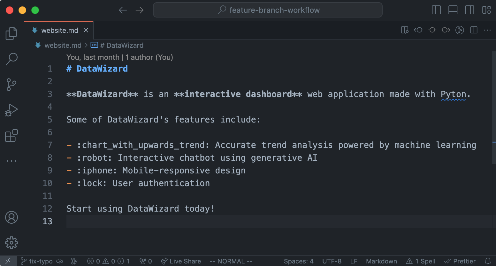
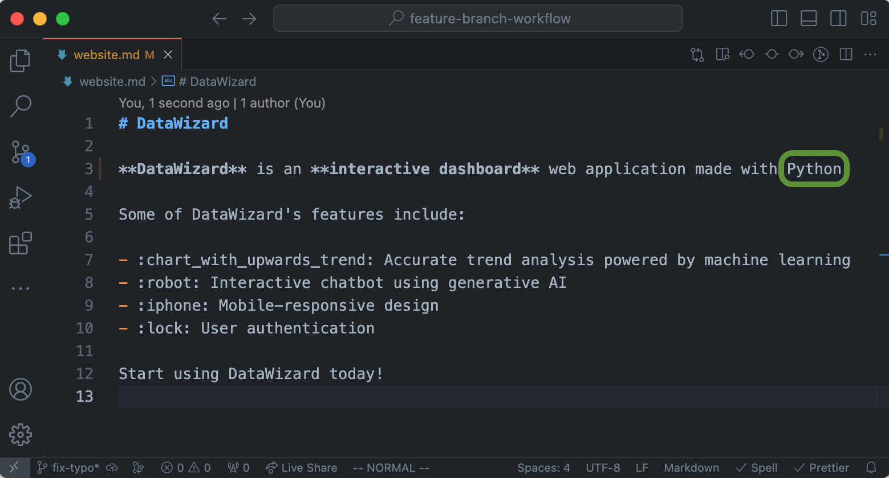

<!--
  <<< Author notes: Step 2 >>>
  Start this step by acknowledging the previous step.
  Define terms and link to docs.github.com.
  TBD-step-2-notes.
-->

## Step 2: Commit changes

_You created a feature branch! :tada:_

Creating a feature branch allows you to edit your project without changing the `main` branch. Now that you have a feature branch, it’s time to fix the embarrassing typo!

### :keyboard: Activity: Commit changes to the feature branch

1. Open this repository in your favorite code editor. For this course, we will be demonstrating using [Visual Studio Code](https://code.visualstudio.com/).
2. Before making changes, double-check that you are in the feature branch `fix-typo`.

```
git branch
```

> [!NOTE]
> The above Git command lists all of the branches in this local repository. The branch name with an asterisk (\*) beside indicates the branch that you are on currently.

2. Open [`website.md`](/website.md) in the code editor.



3. Find the embarrassing typo and fix it!



4. Stage and commit the change.

```
# Stage all changes
git add .

# Commit changes with message
git commit -m "fix: fix typo"
```

> [!TIP]
> In Visual Studio Code and most [IDEs](https://www.geeksforgeeks.org/what-is-ide/), you can use Git via the in-built source control interface. Personally, I find it more convenient to use the source control interface for simple Git commands (e.g. Staging, committing, switching branches) and the command line for more advanced Git commands.
>
> For Visual Studio Code, you may wish to refer to this [guide](https://code.visualstudio.com/docs/sourcecontrol/overview) for more details on the source control interface.

5. Push your fix to the remote repository.

```
git push origin fix-typo
```

6. Return to the GitHub repository page and navigate to the **< > Code** tab under the **fix-typo** branch of your repository.
7. Navigate to the website under [`website.md`](/website.md). You will see your fix reflected.
8. Wait about 20 seconds then refresh this page (the one you're following instructions from). [GitHub Actions](https://docs.github.com/en/actions) will automatically update to the next step.
