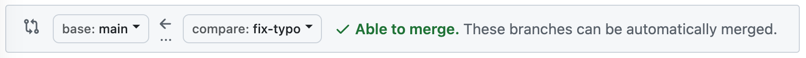
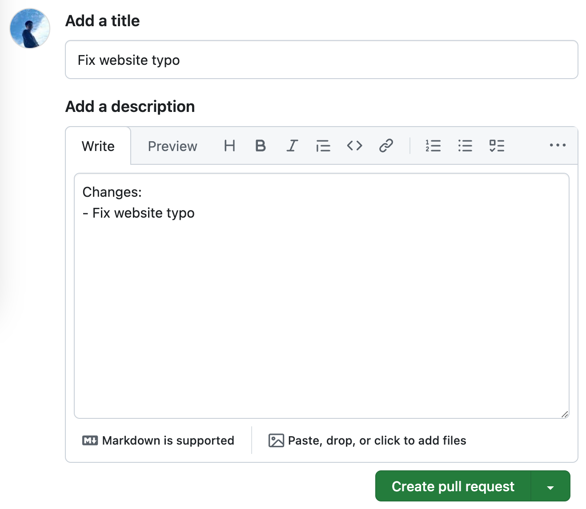
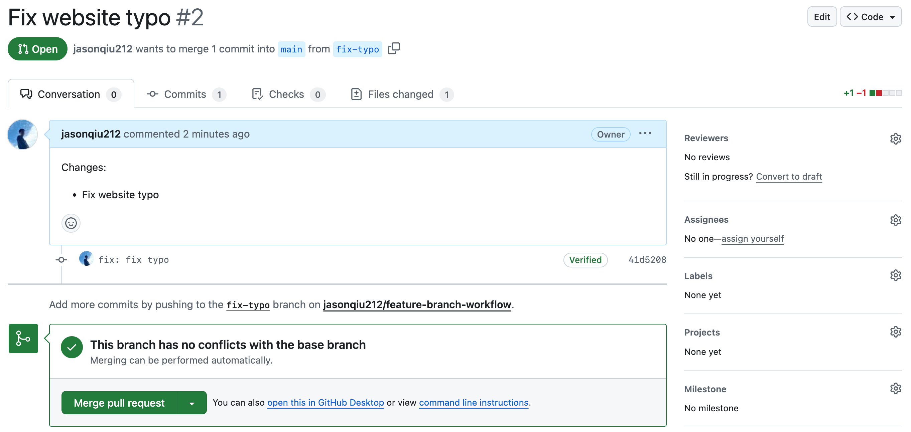
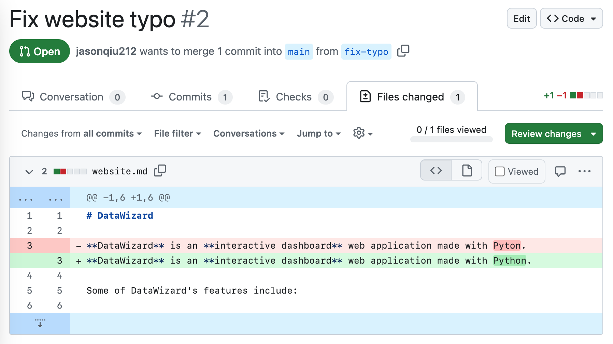
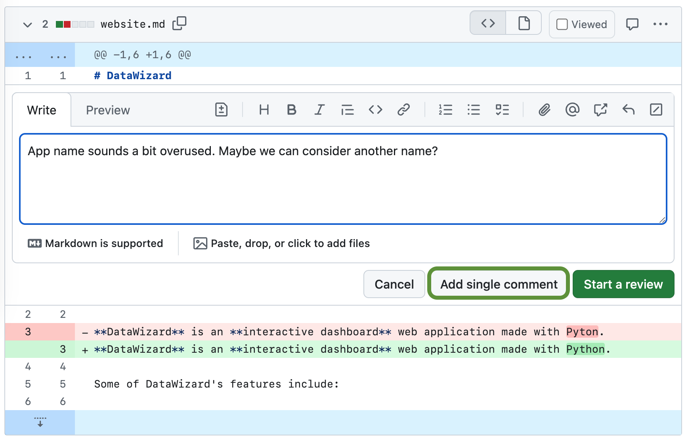

## Step 3: Open a pull request

_You fixed the typo! :sparkles:_

The previous step simulates developing on a feature branch. Of course, in real projects, you may need to fix more than just a simple typo and push dozens of commits. No matter what changes you make in the feature branch, notice that it does **not** affect the `main` branch.

With your fix pushed to the feature branch, it's time to open a **pull request**!

A [pull request](https://docs.github.com/en/pull-requests/collaborating-with-pull-requests/proposing-changes-to-your-work-with-pull-requests/about-pull-requests) is a proposal to merge some code changes from one branch into another. In a pull request, your teammates can review and discuss via comments before merging the changes.

> [!NOTE]
> A pull request is commonly called a PR for short.

### :keyboard: Activity: Open a pull request

1. Click on the **Pull Requests** tab in the GitHub repository.
2. Click on **New pull request**.
3. In the **base** dropdown, select the `main` branch.
4. In the **compare** dropdown, select the `fix-typo` branch. By doing this, we are setting up the pull request to merge the `fix-typo` branch into the `main` branch, as implied by the arrow's direction.

5. Click on **Create pull request**.
6. Enter a title for your pull request. By default, the title will be the name of your branch. For this exercise, let's edit the title to say "Fix website typo".
7. Enter a description for the pull request.

8. Click on **Create pull request**. You will be brought to your new pull request.

Amazing! You have raised a pull request. :tada:

On the **Conversation** tab, we can do lots of things to this pull request. We can:

- Edit the pull request's title and description
- **Reviewers**: Request someone to review your pull request
- **Assignees**: Assign this pull request to someone (This is usually the PR's author)
- **Labels**: Add labels to easily triage through many PRs
- **Merge pull request**: Possibly the most satisfying yet daunting part of raising a pull request, because your code will be merged in after this!

> [!TIP]
> To minimize mistakes, you can add repository settings to only allow PR merges after certain collaborators approve the changes.

9. Click on the **Files changed** tab.

We can see the changes that we made in this pull request, with the red highlights representing deleted lines and green highlights representing added lines.

10. On any pull request, we can add comments! Hover over the line of code where you would like to add a comment, and click on the blue comment icon.

> [!TIP]
> You can comment on multiple lines too by clicking and dragging down to select a range of lines.

11. Type in your comment and click on **Add single comment**. Your comment is now displayed in the code.

> [!NOTE]
> Clicking on **Start a review** allows you to give an explicit approval or request for changes to the PR. You may wish to refer to this [article](https://docs.github.com/en/pull-requests/collaborating-with-pull-requests/reviewing-changes-in-pull-requests/about-pull-request-reviews#about-pull-request-reviews) for more details.

12. Wait about 20 seconds then refresh this page (the one you're following instructions from). [GitHub Actions](https://docs.github.com/en/actions) will automatically update to the next step.
